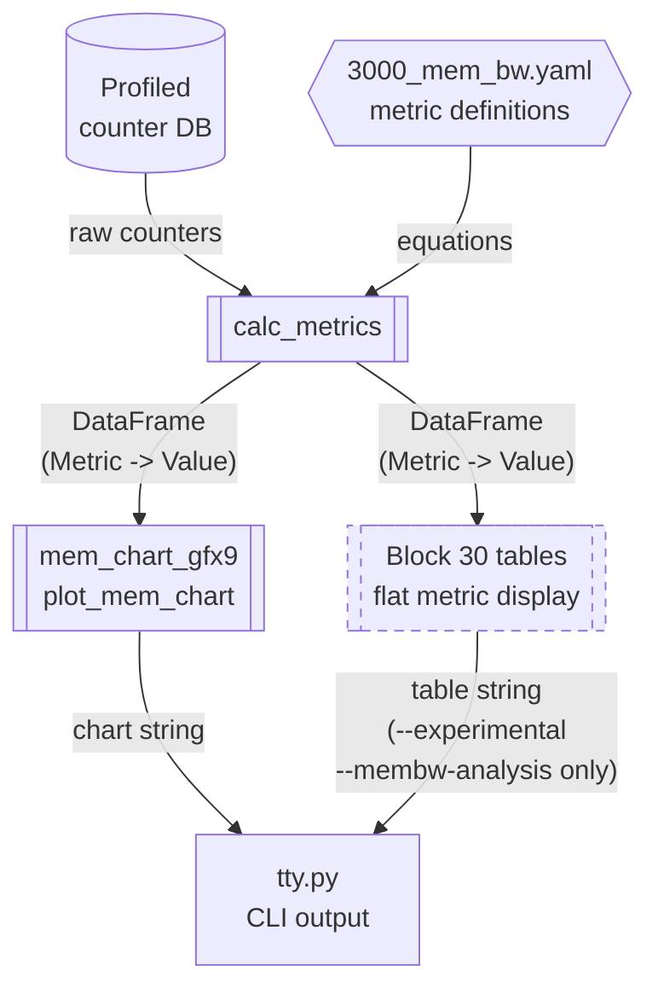
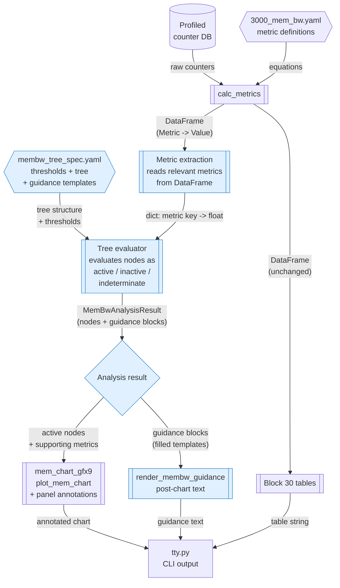
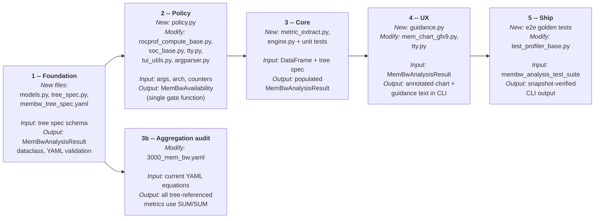

# Memory Bandwidth Analysis in Memory Chart

**Status:** Draft (architecture revision)
**Target:** rocprofiler-compute, gfx950, analyze mode (CLI)

---

## Glossary

| Term | Definition |
|------|------------|
| **Memory Chart** | Graphical representation of the memory hierarchy rendered in analyze mode, populated with numeric metrics. |
| **Block 30** | User-facing section number for Memory Bandwidth Analysis (panel IDs 3000-3099). |
| **GL1** | First-level graphics cache (L1 / TCP path). |
| **GL2** | Second-level graphics cache (L2 / TCC path). |
| **EA** | Efficiency Arbiter -- demarcation between L2 and the memory fabric (HBM, GMI, PCIe). |
| **Optiq** | Downstream performance visualization tool (internal consumer). |
| **`--membw-analysis`** | CLI flag enabling Memory Bandwidth Analysis (block 30).|
| **`normal_unit`** | Normalization unit (e.g. per-wave, per-cycle) used to scale displayed metric values. |

### Requirement prefixes

| Prefix | Meaning |
|--------|---------|
| **FR** | Functional requirement -- externally observable behavior. |
| **NFR** | Non-functional requirement -- performance, compatibility, operability. |

---

## System Context

In analyze mode, rocprof-compute renders the **Memory Chart**, a high-level graphical representation of the memory hierarchy populated with numeric metrics to aid user understanding of their workload's memory performance.

On gfx950, rocprof-compute has memory bandwidth analysis metrics describing bandwidth, latency, and throughput within the memory hierarchy. These metrics live in block 30.

Currently, gfx950 memory bandwidth analysis metrics are hidden behind `--experimental --membw-analysis`. While these metrics are relatable to what the memory chart presents, there is no relationship between the two features.

---

## Problem Statement

**[PS1] No bottleneck identification.**
The memory chart presents metric results but does not identify which memory levels are bottlenecks. Users must manually interpret request counts, hit rates, latencies, and stall indicators across memory levels.

**[PS2] Bottleneck analysis exists but is inaccessible.**
Bottleneck detection logic for GL1/GL2/EA exists in the codebase (as indicators and thresholds in the block 30 YAML) but is gated behind `--experimental --membw-analysis`, disconnected from the memory chart, and presented only as flat metric tables.

**[PS3] No guided analysis.**
Users lack structured guidance when diagnosing memory performance issues. Memory bandwidth guided analysis has been a long-standing user request.

**[PS4] No structured data export.**
Downstream tools (Optiq) hardcode the memory chart structure rather than consuming it from the analysis database. Bottleneck results have no database representation at all. Decoupling these tools requires a structured, data-driven export.

---

## Scope

### In scope

1. **gfx950 only**
2. **Analyze mode only** (profiled data is assumed available)
3. **Memory levels:** GL1, GL2, EA (where bottleneck equations exist today)
4. **CLI renderer only** -- the analysis result model is renderer-agnostic to support future renderers

### Out of scope

| Item | Notes |
|------|-------|
| TUI / GUI rendering | Future work -- would consume the same renderer-agnostic analysis result model |
| Non-CLI output and Optiq integration (PS4) | HTML, structured JSON, Optiq database persistence, and the Optiq JSON schema contract are downstream concerns. `MemBwAnalysisResult` is JSON-serializable to support future integration, but defining export schemas is out of scope. See Open Items for the HTML rendering and Optiq discussions. |

---

## Assumptions

- **[A1]** Bottleneck thresholds in the block 30 YAML comments (e.g. `>= 10%`) are the authoritative starting defaults unless overridden in the bottleneck tree spec.
- **[A2]** The bottleneck tree evaluates on the same normalization scope as the memory chart. One evaluation per chart rendering.

---

## Requirements

### FR1 -- Bottleneck detection on the memory chart (PS1)

Show bottleneck detection results on the memory chart at the relevant memory level, showing only detected (active) bottlenecks along with their supporting metrics.

- **[FR1.1]** Evaluate bottleneck equations from profiled data to produce boolean results per memory level and sub-condition.
- **[FR1.2]** Display only active bottlenecks on the chart -- no visual noise from non-triggered indicators.
- **[FR1.2a]** When no bottlenecks are detected across GL1/GL2/EA, print a single status line below the chart: `Memory Bandwidth Analysis: No bottlenecks detected (GL1 / GL2 / EA).`
- **[FR1.3]** Show supporting metric values alongside each active bottleneck (e.g. `stall rate = 15.2%`). Multiple metrics use the format: `metric1=42% | metric2=1.2M`.
- **[FR1.4]** CLI renderer only.
- **[FR1.5]** This feature requires both `--experimental` and `--membw-analysis` flags. gfx950 only.

**Acceptance (FR1.1):** Given a profiled workload from the membw analysis test suite with a known bottleneck, the engine must mark the corresponding leaf node active and all mutually exclusive siblings inactive.

### FR2 -- Guided analysis text (PS3)

When a bottleneck is detected, provide textual guidance to the user.

- **[FR2.1]** Each guidance block for an active leaf bottleneck must include:
  - **Condition** -- human-readable label and threshold
  - **Measured** -- actual metric value(s) from profiled data
  - **Impact** -- what the bottleneck means for memory performance
  - **Next steps** (optional) -- recommended investigation or remediation directions; content and format to be determined (see LLD discussion items)
- **[FR2.2]** Guidance must incorporate actual metric values via templates, not static text only.
- **[FR2.3]** **Resolved by Decision 3:** Guidance is printed below the memory chart, separated by a visible delimiter, immediately following chart output. Chart blocks carry short annotation labels only.

### FR3 -- Gate consolidation (PS2)

The `--membw-analysis` flag is currently checked in multiple independent callsites across the codebase. Consolidate these to a single policy function that returns an availability status (available, arch unsupported, counters missing, or disabled by flag). All existing gate callsites delegate to this function.

---

## Non-Functional Requirements

- **[NFR1]** Bottleneck tree evaluation must not introduce noticeable latency in the analyze pipeline.
- **[NFR2]** Minimum terminal width for full chart rendering: 240 columns. Narrower terminals or piped output fall back to tabular guidance without chart annotations (chart may truncate with a warning).
- **[NFR3]** Bottleneck indicators must be visible without color: every annotation includes a symbol prefix (e.g. `[!]`) in addition to optional color.
- **[NFR4]** Maximum active guidance blocks displayed: 5. Overflow: `...and N more (see block 30 for full detail)`.
- **[NFR5]** Bottleneck indicator metrics are independent of `--normal-unit`. All 21 tree-referenced metrics use hardware cycle counter denominators (e.g. `SUM(TCP_GATE_EN2_sum)`, `SUM(TCC_BUSY_sum)`) baked into their formulas -- never `$denom`. The chart heading's normalization label (e.g. `Normalization: per_kernel`) applies to traffic count metrics in the memory chart only and must not be interpreted as governing bottleneck annotation values. The tree spec validator must enforce this invariant: no tree-referenced metric may contain `$denom` in its formula.

---

## Design Decisions

### Decision 1: Where do bottleneck equations live?

Bottleneck equations form a dependency tree where child conditions reference parent results and use negation (e.g. a UTCL1 stall sub-condition requires its parent TCP stall condition to be true; a catch-all "other" sub-condition requires siblings to be false).

| Option | Description | Pros | Cons |
|--------|------------|------|------|
| Pure YAML | Define all equations as YAML metrics with a new annotation | Consistent with existing metric authoring | YAML engine cannot reference other metric results, express negation, or model parent/child dependencies |
| **Hybrid (chosen)** | **Raw stall rate metrics in YAML; thresholds + tree in a separate YAML spec; evaluation in Python** | Reuses existing YAML metrics; tree logic expressed naturally in Python; thresholds remain editable in config | Two config files plus evaluator code to understand the full picture |
| Pure Python | All definitions (thresholds, tree, boolean logic) in Python | Single location for all logic | Threshold values in code, inconsistent with metric authoring pattern, harder to tune |

**Artifact boundaries:**

| Artifact | Owns |
|----------|------|
| Block 30 YAML (existing) | Counter equations, units, descriptions |
| Bottleneck tree spec YAML (new) | Node IDs, parent refs, threshold keys, guidance template IDs |
| Python evaluator (new) | Boolean logic, indeterminate propagation, template fill |

Startup validation: every metric key in the tree spec must exist in the block 30 YAML; every threshold key must exist in the tree spec's thresholds section.

### Decision 2: How do bottleneck results reach the memory chart renderer?

The memory chart renderer currently receives a flat metric dictionary. Bottleneck results are hierarchical (parent/child booleans with supporting values).

| Option | Description | Pros | Cons |
|--------|------------|------|------|
| Extend metric dict | Flatten bottleneck booleans into the existing dict | Minimal change to data flow | Loses hierarchy; mixes raw metrics with derived analysis |
| **Separate data channel (chosen)** | **Pass the analysis result as a new optional parameter to the chart renderer** | Clean separation; structured representation preserves hierarchy | Requires updating function signature and call sites |

A separate guidance rendering function is called after the chart renderer and concatenated for output.

**Cross-block data flow.** This introduces a cross-block dependency: the memory chart renderer (block 3) receives a `MemBwAnalysisResult` derived from block 30 (`3000_mem_bw.yaml`) metrics. This is an intentional, temporary deviation from the convention that each block renders independently.

Why it is acceptable:

1. **Metadata crosses the boundary, not raw metrics.** The chart renderer receives a typed analytical object containing boolean states, display labels, and pre-rendered guidance text. It does not read block 30 DataFrames or reference block 30 metric keys. The evaluator (`membw/engine.py`) is the boundary: it consumes block 30 data and produces renderer-agnostic analysis results.
2. **Phased path toward consolidation.** Block 30 metrics are planned to merge into block 3 (see Open Items: "Consolidate block 30 into memory chart"). At that point the cross-block dependency disappears. This phase introduces the evaluator and analysis result model while the metrics mature under the `--experimental --membw-analysis` gate.
3. **Optional parameter.** When block 30 data is absent (wrong arch, missing counters, flag not set), `membw` is `None` and the chart renders exactly as it does today.

### Decision 3: How are bottleneck indicators displayed to the user?

The CLI memory chart renderer uses Rich composable panels and grids to lay out the memory hierarchy. Each cache block is built via shared panel builders; edges between blocks are Rich text columns with formatted bandwidth and request flow labels.

| Option | Description | Pros | Cons |
|--------|------------|------|------|
| Annotate blocks only | Colored text within or adjacent to cache panels | Visual proximity to memory level | Limited space; no room for guidance text |
| Dedicated chart region | New area on the chart listing active bottlenecks | More space for detail | Layout complexity |
| Separate panel only | Rich table or text block after the chart | Simplest implementation | Loses visual connection to memory levels |
| **Annotate blocks + guidance below (chosen)** | **Short labels added as rows in cache panels; detailed guidance printed below the chart** | Visual proximity on chart; guidance has room for detail and metric values | Two rendering concerns (panel annotations + post-chart text) |

**Annotation approach:**

- Short labels added as rows to the existing cache panel builders for the relevant memory level (e.g. a stall indicator row in the GL1 cache panel)
- Annotation lines can be inserted into the edge column markup between blocks
- A summary section is printed below the main chart grid, before the legend
- Color when TTY supports it; symbol prefix always present (NFR3)

**Guidance rules:**

- Printed below the chart, separated by a visible delimiter
- One block per active **leaf** bottleneck (max 5 per NFR4)
- Template structure: Condition / Measured / Impact (next steps format TBD)

### Decision 4: Metric aggregation contract

All ratio metrics used by the bottleneck tree **must** use pairwise `SUM(numerator) / SUM(denominator)` aggregation across selected kernels/dispatches.

- **Never** `AVG(A) / AVG(B)` for bottleneck tree inputs
- If denominator `SUM == 0`, the metric is **indeterminate** (not zero, not inactive)
- Indeterminate nodes are omitted from display; they are never treated as non-bottlenecks
- The block 30 YAML must be audited for `AVG/AVG` pairs referenced by tree nodes; these must be aligned or excluded before merge
- Validate threshold changes against the membw analysis test suite workloads before merge

### Current data flow (before this feature)

Today, block 30 metrics and the memory chart are disconnected. The memory chart renders raw metrics with no analysis; block 30 tables display flat indicator values behind an experimental gate.

### Proposed data flow (Decisions 1-3)

The new flow introduces a tree evaluator between metric computation and rendering. It consumes the same computed metrics, applies the bottleneck tree spec, and produces a structured analysis result that feeds both chart annotations and a guidance section.

---

## Architecture

### Rendering separation

Chart annotation and guidance text are implemented as separate rendering paths with independent error handling. A failure in guidance rendering must not suppress the memory chart.

---

## Compatibility

The bottleneck tree spec YAML is the primary configuration artifact consumed by the evaluator. To detect structural incompatibilities when the spec format evolves, the evaluator computes a hash of the tree spec's schema structure at load time and validates it against a set of known supported hashes. This replaces a simple version integer with a mechanism that automatically detects any structural change, ensuring the evaluator never silently misinterprets a modified spec.

---

## Failure Modes (summary)

| Failure | User-visible behavior |
|---------|----------------------|
| Unsupported arch (not gfx950) | Memory chart renders normally; one-line stderr notice |
| Missing counters (legacy profile) | Memory chart renders; guidance area shows unavailable notice |
| Malformed tree spec | Hard error at analyze startup with validation message |
| All nodes indeterminate | `Memory Bandwidth Analysis: Inconclusive (insufficient counter data).` |

See the companion LLD for the full failure mode matrix.

---

## Implementation Sequence

All new files live under `src/rocprof_compute_analysis/membw/`. Implementation details for all phases are in `lld-membw-guided-analysis-in-memchart.md`.

---

## Validation

Unit tests cover tree evaluation (parameterized vectors per GL1/GL2/EA), indeterminate propagation (missing/NaN counters produce indeterminate, not inactive), sibling negation logic, and availability policy logic. Tree spec validation tests confirm that invalid metric or threshold references fail at load time.

Integration tests validate the full pipeline from metric computation through the evaluator to chart rendering and guidance output, including graceful handling of legacy profiles missing membw counters.

End-to-end golden tests use the membw analysis test suite with baseline/optimized workload pairs, verifying annotation strings and the zero-bottleneck status line.

---

## Open Items

| Item | Owner | Target |
|------|-------|--------|
| Optiq integration (PS4) | TBD | Structured export and JSON schema alignment -- coordinate with Optiq team to define a schema that accommodates `MemBwAnalysisResult` (bottleneck annotations, guidance blocks) |
| HTML rendering for memory chart | TBD | An HTML output path (similar to roofline) would remove CLI terminal width constraints (NFR2) and enable richer visualization |
| Counter single-pass feasibility sign-off on MI350 hardware | TBD | Before shipping |
| Guidance content finalization | TBD | Template content for all GL2/EA leaf nodes, and whether to include a "next steps" field (content, format TBD) -- see LLD discussion items |
| Whether optional impact normalization formulas live in YAML or code | TBD | Core phase |
| Severity ranking across bottleneck types for prioritized display | TBD | Future consideration |
| Consolidate block 30 into memory chart | TBD | When stable, merge tree-referenced metrics into `0300_memory_chart.yaml`, remove `--membw-analysis` and `--experimental` gates |
| User-understandable IP block terminology | TBD | Internal hardware acronyms (TCP, TCC, TA, TD, UTCL1, EA, etc.) appear in metric names, chart labels, guidance text, and bottleneck node labels. A tool-wide audit and terminology strategy (rename, alias, or translation layer) is needed to improve comprehensibility for users unfamiliar with GPU microarchitecture. Scope is not limited to this feature. |
