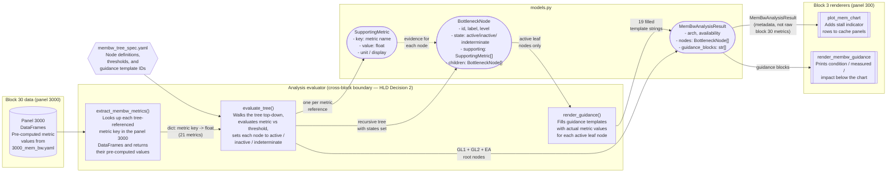
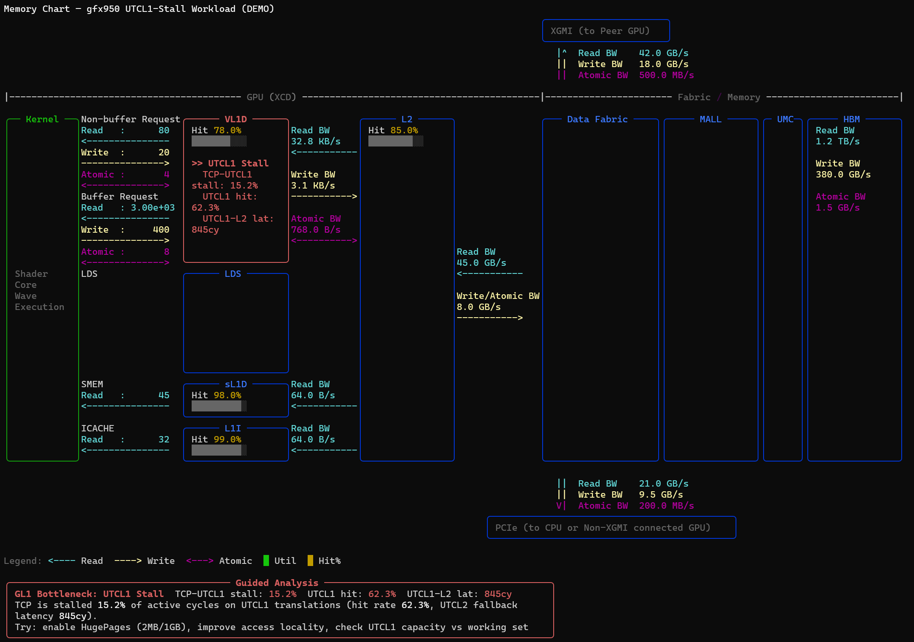
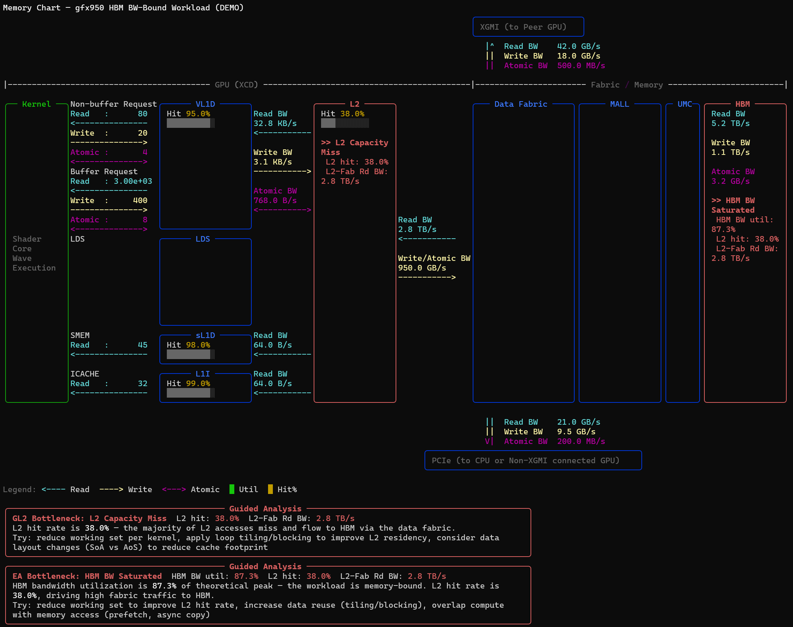

# LLD: Memory Bandwidth Guided Analysis in Memory Chart

## Motivation

This document covers the implementation details for the memory bandwidth guided analysis feature described in `hld-membw-guided-analysis-in-memchart.md`. Sections are ordered to match the HLD implementation sequence so this document can be read top-to-bottom as a complementary implementation guide.

---

## Discussion Items

The following items are flagged for interactive discussion before finalizing:

| Item | Context |
|------|---------|
| Guidance "next steps" field | FR2.1 includes an optional "next steps" field in guidance blocks. The content, format, and whether to include remediation recommendations at all needs discussion. |

---

## Counter Collection Prerequisites

This is the first implementation prerequisite -- the feature cannot function without the required counters in the gfx950 profile.

**Validation steps before merge:**

1. List all counters referenced in `3000_mem_bw.yaml` via `tools/counter_grouping_inspector.py`
2. Confirm single-pass (or documented multi-pass) feasibility for TA, TCP/L1, and TCC/L2 counter groups on gfx950
3. Extend default counter set for gfx950 standard profile to include block 30 counters
4. Document any counters that require an extra profiling pass (fallback: partial availability with notice)

**Counters required by the bottleneck tree** (derived from metric formulas):

| IP Block | Counters |
|----------|----------|
| SQ | `SQ_VMEM_TA_CMD_FIFO_FULL`, `SQ_BUSY_CYCLES` |
| TA | `TA_ADDR_STALLED_BY_TC_CYCLES_sum`, `TA_TA_BUSY_sum` |
| TCP | `TCP_TCP_TA_ADDR_STALL_CYCLES_sum`, `TCP_GATE_EN2_sum`, `TCP_UTCL1_STALL_INFLIGHT_MAX_sum`, `TCP_UTCL1_STALL_LFIFO_NO_RES_sum`, `TCP_TD_TCP_STALL_CYCLES_sum`, `TCP_TCR_TCP_STALL_CYCLES_sum` |
| TCC | `TCC_BUSY_sum`, `TCC_IB_STALL_sum`, `TCC_HIT_sum`, `TCC_MISS_sum`, `TCC_LATENCY_FIFO_FULL_sum`, `TCC_SRC_FIFO_FULL_sum`, `TCC_EA0_RDREQ_DRAM_CREDIT_STALL_sum`, `TCC_EA0_WRREQ_DRAM_CREDIT_STALL_sum`, `TCC_EA0_RDREQ_GMI_CREDIT_STALL_sum`, `TCC_EA0_WRREQ_GMI_CREDIT_STALL_sum`, `TCC_EA0_RDREQ_IO_CREDIT_STALL_sum`, `TCC_EA0_WRREQ_IO_CREDIT_STALL_sum`, `TCC_EA0_WRREQ_STALL_sum`, `TCC_TOO_MANY_EA_WRREQS_STALL_sum`, `TCC_EA0_WRREQ_ATOMIC_DRAM_sum`, `TCC_EA0_WRREQ_DRAM_sum` |

---

## Simplifying `--membw-analysis` Flag Checks

The `--membw-analysis` flag is currently checked in 5 independent places across the codebase. Before implementing the new feature, this should be cleaned up by moving the gate earlier in the data-loading pipeline, reducing the check count from 5 to 3.

### Current state (5 checks)

| # | File | Stage | Purpose |
|---|------|-------|---------|
| 1 | `src/rocprof_compute_soc/soc_base.py` (`detect_counters`) | Profiling | Excludes file ID "3000" from counter collection |
| 2 | `src/rocprof_compute_soc/soc_base.py` (`_iter_arch_analysis_yaml_metrics`) | Profiling | Excludes "3000" from metric iteration |
| 3 | `src/rocprof_compute_base.py` | Validation | Validates `-b 30` requires `--experimental --membw-analysis` |
| 4 | `src/utils/tty.py` (`show_all`) | Rendering | Skips panel 3000 in CLI |
| 5 | `src/rocprof_compute_tui/utils/tui_utils.py` | Rendering | Skips panel 3000 in TUI |

The rendering checks (4, 5) exist because the data-loading path (`build_dfs` in `parser.py`) has no `membw_analysis` check -- panel 3000 is loaded and evaluated even without the flag if the profiled data contains block 30 counters. The webui (`analysis_webui.py`) is missing a check entirely and would render panel 3000 ungated.

### Cleanup: move check into data-loading (3 checks)

Add a `membw_analysis` check in `build_dfs` (`src/utils/parser.py`) to skip panel 3000 when the flag is not set. This follows the same pattern `build_dfs` already uses for `profile_panel_filter` and `filter_metrics`. When panel 3000 is never loaded into `workload.dfs`, all renderers (CLI, TUI, webui) naturally skip it -- no data, no rendering.

**After cleanup:**

| # | File | Stage | Purpose |
|---|------|-------|---------|
| 1 | `src/rocprof_compute_soc/soc_base.py` (`detect_counters`) | Profiling | Excludes "3000" from counter collection (unique counters add profiling passes) |
| 2 | `src/rocprof_compute_soc/soc_base.py` (`_iter_arch_analysis_yaml_metrics`) | Profiling | Excludes "3000" from metric iteration |
| 3 | `src/rocprof_compute_base.py` | Validation | User-facing error when `-b 30` passed without required flags |

**Removed:**
- `src/utils/tty.py` line 898 -- unnecessary, panel 3000 not in `workload.dfs`
- `src/rocprof_compute_tui/utils/tui_utils.py` line 151 -- unnecessary, same reason
- `src/rocprof_compute_analyze/analysis_webui.py` -- missing check fixed for free

---

## Data Models

The following diagram shows where each data model is created, what it contains, and how it flows through the pipeline:



The diagram groups components into three zones to show the cross-block boundary (HLD Decision 2). Block 30 data (left) enters the analysis evaluator (center), which transforms raw metric values into a renderer-agnostic `MemBwAnalysisResult`. Only this typed analytical object -- containing boolean states, display labels, and pre-rendered guidance text -- crosses into the block 3 renderers (right). The renderers never see block 30 metric keys or DataFrames directly.

- **SupportingMetric** -- created by `engine.py` for each metric referenced by a tree node. Carries the raw value and pre-formatted display string.
- **BottleneckNode** -- assembled by `engine.py` as a recursive tree. Each node's `state` is set during evaluation. `supporting` metrics attach the evidence. `children` form the parent->child hierarchy.
- **MemBwAnalysisResult** -- the top-level container returned by `engine.py`. Holds the root nodes and pre-rendered guidance blocks (filled by `guidance.py`). Consumed by both the chart renderer and the guidance renderer.

### MemBwAnalysisResult

```python
@dataclass(frozen=True)
class SupportingMetric:
    key: str            # YAML metric key, e.g. "L1 Cache - TCP stalled by UTCL1"
    value: float | None
    unit: str           # "Percent", "Cycles per Request", etc.
    display: str        # pre-formatted, e.g. "15.2%"

@dataclass(frozen=True)
class BottleneckNode:
    id: str             # e.g. "gl1_tcp_utcl1_stall"
    label: str          # user-facing short label for chart, e.g. "TCP<-UTCL1"
    level: Literal["GL1", "GL2", "EA"]
    state: Literal["active", "inactive", "indeterminate"]
    supporting: tuple[SupportingMetric, ...]
    children: tuple["BottleneckNode", ...]

@dataclass(frozen=True)
class MemBwAnalysisResult:
    arch: str           # "gfx950"
    availability: Literal["full", "partial", "unavailable"]
    availability_reason: str | None  # e.g. "counters_missing", "arch_unsupported"
    nodes: tuple[BottleneckNode, ...]      # top-level nodes (GL1, GL2, EA roots)
    guidance_blocks: tuple[str, ...]       # pre-rendered guidance text blocks
```

**Example populated instance** (from a UTCL1-stall workload):

```python
MemBwAnalysisResult(
    arch="gfx950",
    availability="full",
    availability_reason=None,
    nodes=(
        BottleneckNode(
            id="gl1_tcp_stall",
            label="TCP stall",
            level="GL1",
            state="active",
            supporting=(
                SupportingMetric(
                    key="L1 Cache - TA stalled by TCP (aggregated)",
                    value=22.4,
                    unit="Percent",
                    display="22.4%",
                ),
            ),
            children=(
                BottleneckNode(
                    id="gl1_tcp_utcl1_stall",
                    label="TCP<-UTCL1",
                    level="GL1",
                    state="active",
                    supporting=(
                        SupportingMetric(
                            key="L1 Cache - TCP stalled by UTCL1",
                            value=18.7,
                            unit="Percent",
                            display="18.7%",
                        ),
                    ),
                    children=(),
                ),
                BottleneckNode(
                    id="gl1_tcp_other_stall",
                    label="TCP other",
                    level="GL1",
                    state="inactive",  # sibling is active, so this is suppressed
                    supporting=(),
                    children=(),
                ),
            ),
        ),
    ),
    guidance_blocks=(
        "[GL1] TCP stalled by UTCL1\n"
        "  Condition : UTCL1 translation stall rate >= 10%\n"
        "  Measured  : 18.7% (threshold: 10.0%)\n"
        "  Impact    : Address translation pressure -- TCP blocked waiting on L1 TLB",
    ),
)
```

---

## Tree Spec Schema

### `membw_tree_spec.yaml` structure

The tree spec defines the bottleneck evaluation tree. Each node references a metric from `3000_mem_bw.yaml` by its exact metric key (the `metric` field). The formula for each metric is defined in `3000_mem_bw.yaml` and is **not** duplicated in the tree spec -- the `metric` key serves as the lookup reference into both the YAML config (for formula definition) and the panel 3000 DataFrame (for pre-computed values).

**Node fields:**

| Field | Required | Description |
|-------|----------|-------------|
| `level` | yes | Memory level: `GL1`, `GL2`, or `EA` |
| `metric` | yes* | Exact metric key from `3000_mem_bw.yaml` -- used to look up the pre-computed value in the panel 3000 DataFrame |
| `op` | yes* | Comparison operator: `gte`, `gt`, `lte`, `lt` |
| `threshold` | yes* | Reference to a named threshold value |
| `label` | yes | Short display label for chart annotation |
| `children` | no | Child nodes (evaluated only when parent is active) |
| `guidance_id` | no | Reference to `guidance_templates` entry (leaf nodes only) |
| `requires_parent` | no | If `true`, node is only evaluated when parent is active |
| `requires_siblings_false` | no | List of sibling node IDs that must be inactive for this node to be active (catch-all pattern) |

\* Not required on catch-all nodes that use `requires_parent` + `requires_siblings_false` instead of a metric check.

**Evaluation rules:**

| Rule | Behavior |
|------|----------|
| Active | `metric <op> threshold` evaluates true |
| Inactive | `metric <op> threshold` evaluates false |
| Indeterminate | Metric value is `None` or `NaN` (never treated as inactive) |
| Parent gating | Children are only evaluated when parent is active |
| Sibling exclusion | `requires_siblings_false` node is active only if all listed siblings are inactive |
| Guidance | Only leaf nodes (no children) produce guidance blocks |

The complete file is shown below. The `thresholds` section defines named values, and the `nodes` section contains all three memory level subtrees (GL1, GL2, EA) as siblings under a single `nodes:` key.

```yaml
# membw_tree_spec.yaml -- gfx950 bottleneck evaluation tree
# Location: src/rocprof_compute_analysis/membw/tree_spec/gfx950_membw_tree_spec.yaml
#
# This is a single file. The GL1, GL2, and EA subtrees are all entries
# under the top-level `nodes:` key.
#
# Each node's `metric` field is the exact key from 3000_mem_bw.yaml.
# The formula for each metric is defined there -- not duplicated here.

thresholds:
  stall_pct_high: 10.0      # >= 10% stall rate indicates bottleneck
  cache_hit_low: 50.0       # <= 50% hit rate indicates capacity issue
  traffic_ratio_high: 50.0  # > 50% traffic ratio indicates poor locality
  utilization_high: 80.0    # > 80% utilization for compound BW-bound check
  balance_read_dom: 80.0    # > 80% read fraction = read-dominant
  balance_write_dom: 20.0   # < 20% read fraction = write-dominant

nodes:

  # --- GL1: L1 Cache Bottleneck Detection ---
  # Source metrics: Table 3001 (L1 Cache) in 3000_mem_bw.yaml
  #
  # GL1 detects L1 cache stall bottlenecks. The primary entry point is
  # "TA stalled by TCP" -- when it exceeds the threshold, child nodes
  # identify the specific stall source (UTCL1, UTCL2, TD, L2, or other).

  gl1_tcp_stall:
    level: GL1
    metric: "L1 Cache - TA stalled by TCP (aggregated)"
    op: gte
    threshold: stall_pct_high
    label: "TCP stall"
    children:

      gl1_tcp_utcl1_stall:
        metric: "L1 Cache - TCP stalled by UTCL1"
        op: gte
        threshold: stall_pct_high
        label: "TCP<-UTCL1"
        guidance_id: gl1_tcp_utcl1

      gl1_tcp_utcl2_stall:
        metric: "L1 Cache - TCP stalled by UTCL2"
        op: gte
        threshold: stall_pct_high
        label: "TCP<-UTCL2"
        guidance_id: gl1_tcp_utcl2

      gl1_tcp_td_stall:
        metric: "L1 Cache - TCP stalled by TD"
        op: gte
        threshold: stall_pct_high
        label: "TCP<-TD"
        guidance_id: gl1_tcp_td

      gl1_tcp_l2_stall:
        metric: "L1 Cache - TCP stalled by L2"
        op: gte
        threshold: stall_pct_high
        label: "TCP<-L2"
        guidance_id: gl1_tcp_l2

      gl1_tcp_other_stall:
        requires_parent: true
        requires_siblings_false:
          - gl1_tcp_utcl1_stall
          - gl1_tcp_utcl2_stall
          - gl1_tcp_td_stall
          - gl1_tcp_l2_stall
        label: "TCP other"
        guidance_id: gl1_tcp_other

  gl1_vmem_stall:
    level: GL1
    metric: "L1 Cache - VMEM stalled by L1 Cache"
    op: gte
    threshold: stall_pct_high
    label: "VMEM stall"
    guidance_id: gl1_vmem

  # --- GL2: L2 Cache Bottleneck Detection ---
  # Source metrics: Table 3012 (L2 Bottleneck Detection Indicators) in 3000_mem_bw.yaml
  #
  # GL2 detects L2 cache bottlenecks: back pressure (L2 stalling L1),
  # internal resource pressure (FIFO saturation), memory bandwidth bound
  # (HBM credit stalls), and cache efficiency.

  gl2_back_pressure:
    level: GL2
    metric: "L2 Back Pressure Indicator"
    op: gte
    threshold: stall_pct_high
    label: "L2 back pressure"
    guidance_id: gl2_back_pressure

  gl2_mem_bw_bound:
    level: GL2
    metric: "L2 Memory BW Bound - Combined Credit Pressure"
    op: gte
    threshold: stall_pct_high
    label: "HBM BW bound"
    children:

      gl2_mem_bw_read:
        metric: "L2 Memory BW Bound - Read Credit Pressure"
        op: gte
        threshold: stall_pct_high
        label: "HBM read"
        guidance_id: gl2_mem_bw_read

      gl2_mem_bw_write:
        metric: "L2 Memory BW Bound - Write Credit Pressure"
        op: gte
        threshold: stall_pct_high
        label: "HBM write"
        guidance_id: gl2_mem_bw_write

  gl2_internal_resource:
    level: GL2
    metric: "L2 Internal Resource Pressure - Latency FIFO"
    op: gte
    threshold: stall_pct_high
    label: "L2 LFIFO full"
    guidance_id: gl2_latency_fifo

  gl2_src_fifo:
    level: GL2
    metric: "L2 Internal Resource Pressure - Source FIFO"
    op: gte
    threshold: stall_pct_high
    label: "L2 SFIFO full"
    guidance_id: gl2_src_fifo

  gl2_cache_efficiency:
    level: GL2
    metric: "L2 Cache Efficiency"
    op: lte
    threshold: cache_hit_low
    label: "L2 low hit rate"
    guidance_id: gl2_cache_efficiency

  gl2_remote_pressure:
    level: GL2
    metric: "L2 Remote Access Pressure (GMI)"
    op: gte
    threshold: stall_pct_high
    label: "GMI pressure"
    guidance_id: gl2_remote_pressure

  # --- EA: Efficiency Arbiter Bottleneck Detection ---
  # Source metrics: Table 3018 (EA Bottleneck Detection Indicators) in 3000_mem_bw.yaml
  # EA sits between L2 (TCC) and the SoC Data Fabric (HBM, GMI, PCIe)
  #
  # EA detects memory fabric bottlenecks. Primary indicators are HBM credit
  # stalls, with GMI and IO as secondary paths.

  ea_hbm_bw_bound:
    level: EA
    metric: "EA HBM BW Bound - Combined"
    op: gte
    threshold: stall_pct_high
    label: "EA HBM BW"
    children:

      ea_hbm_read:
        metric: "EA HBM BW Bound - Read Credit Pressure"
        op: gte
        threshold: stall_pct_high
        label: "EA HBM read"
        guidance_id: ea_hbm_read

      ea_hbm_write:
        metric: "EA HBM BW Bound - Write Credit Pressure"
        op: gte
        threshold: stall_pct_high
        label: "EA HBM write"
        guidance_id: ea_hbm_write

  ea_gmi_bw_bound:
    level: EA
    metric: "EA GMI BW Bound - Combined"
    op: gte
    threshold: stall_pct_high
    label: "EA GMI BW"
    guidance_id: ea_gmi

  ea_io_bw_bound:
    level: EA
    metric: "EA IO BW Bound - Combined"
    op: gte
    threshold: stall_pct_high
    label: "EA IO BW"
    guidance_id: ea_io

  ea_write_backpressure:
    level: EA
    metric: "EA Write Backpressure"
    op: gte
    threshold: stall_pct_high
    label: "EA write stall"
    guidance_id: ea_write_backpressure

  ea_atomic_pressure:
    level: EA
    metric: "EA HBM Atomic Pressure"
    op: gte
    threshold: stall_pct_high
    label: "EA atomics"
    guidance_id: ea_atomic
```

### Metric-to-threshold cross-reference

All bottleneck indicator metrics in `3000_mem_bw.yaml` use `SUM/SUM` aggregation. The `AVG/AVG` pattern appears only in latency metrics (tables 3002, 3008, 3014) which are not referenced by the tree.

| Metric key | Table | Denominator | Threshold | Tree node |
|-----------|-------|-------------|-----------|-----------|
| L1 Cache - TA stalled by TCP (aggregated) | 3001 | `TCP_GATE_EN2_sum` | >= 10% | `gl1_tcp_stall` |
| L1 Cache - TCP stalled by UTCL1 | 3001 | `TCP_GATE_EN2_sum` | >= 10% | `gl1_tcp_utcl1_stall` |
| L1 Cache - TCP stalled by UTCL2 | 3001 | `TCP_GATE_EN2_sum` | >= 10% | `gl1_tcp_utcl2_stall` |
| L1 Cache - TCP stalled by TD | 3001 | `TCP_GATE_EN2_sum` | >= 10% | `gl1_tcp_td_stall` |
| L1 Cache - TCP stalled by L2 | 3001 | `TCP_GATE_EN2_sum` | >= 10% | `gl1_tcp_l2_stall` |
| L1 Cache - VMEM stalled by L1 Cache | 3001 | `SQ_BUSY_CYCLES` | >= 10% | `gl1_vmem_stall` |
| L2 Back Pressure Indicator | 3012 | `TCC_BUSY_sum` | >= 10% | `gl2_back_pressure` |
| L2 Memory BW Bound - Combined Credit Pressure | 3012 | `TCC_BUSY_sum` | >= 10% | `gl2_mem_bw_bound` |
| L2 Memory BW Bound - Read Credit Pressure | 3012 | `TCC_BUSY_sum` | >= 10% | `gl2_mem_bw_read` |
| L2 Memory BW Bound - Write Credit Pressure | 3012 | `TCC_BUSY_sum` | >= 10% | `gl2_mem_bw_write` |
| L2 Internal Resource Pressure - Latency FIFO | 3012 | `TCC_BUSY_sum` | >= 10% | `gl2_internal_resource` |
| L2 Internal Resource Pressure - Source FIFO | 3012 | `TCC_BUSY_sum` | >= 10% | `gl2_src_fifo` |
| L2 Cache Efficiency | 3012 | `TCC_HIT + TCC_MISS` | <= 50% | `gl2_cache_efficiency` |
| L2 Remote Access Pressure (GMI) | 3012 | `TCC_BUSY_sum` | >= 10% | `gl2_remote_pressure` |
| EA HBM BW Bound - Combined | 3018 | `TCC_BUSY_sum` | >= 10% | `ea_hbm_bw_bound` |
| EA HBM BW Bound - Read Credit Pressure | 3018 | `TCC_BUSY_sum` | >= 10% | `ea_hbm_read` |
| EA HBM BW Bound - Write Credit Pressure | 3018 | `TCC_BUSY_sum` | >= 10% | `ea_hbm_write` |
| EA GMI BW Bound - Combined | 3018 | `TCC_BUSY_sum` | >= 10% | `ea_gmi_bw_bound` |
| EA IO BW Bound - Combined | 3018 | `TCC_BUSY_sum` | >= 10% | `ea_io_bw_bound` |
| EA Write Backpressure | 3018 | `TCC_BUSY_sum` | >= 10% | `ea_write_backpressure` |
| EA HBM Atomic Pressure | 3018 | `TCC_EA0_WRREQ_DRAM_sum` | >= 10% | `ea_atomic_pressure` |

### Metrics NOT referenced by the tree

The following table 3012/3018 metrics are diagnostic context, not bottleneck gates:

| Metric | Reason not in tree |
|--------|-------------------|
| L2 to Memory Traffic Ratio | Diagnostic (cache locality measure), not a stall indicator |
| EA Read/Write Balance | Diagnostic (traffic characterization), not a bottleneck condition |
| EA Stall Destination Dominance - HBM/GMI/IO | Informational ranking (which path dominates), not a threshold-gated bottleneck |

These could be included as `supporting` metrics on parent nodes for context without being tree evaluation nodes.

---

## Package Layout

```
src/rocprof_compute_analysis/membw/
|-- __init__.py
|-- models.py          # MemBwAnalysisResult, BottleneckNode, SupportingMetric
|-- metric_extract.py  # keyed metric values from calc_metrics output
|-- engine.py          # tree evaluation
|-- tree_spec.py       # load + validate membw_tree_spec.yaml
|-- guidance.py        # template rendering
\-- tree_spec/
    \-- gfx950_membw_tree_spec.yaml
```

---

## Metric Extraction

The tree evaluator consumes pre-computed metric values from the panel 3000 DataFrames. All tree-referenced metrics use `SUM/SUM` formulas in the YAML, which the existing evaluation pipeline (`eval_metric()` in `evaluation_pipeline.py`) evaluates as direct ratios across all dispatches with no additional averaging. The resulting DataFrame values satisfy Decision 4's aggregation contract as-is.

`metric_extract.py` looks up each tree-referenced metric by its exact key string (e.g. `"L1 Cache - TCP stalled by UTCL1"`) in the panel 3000 table DataFrames and returns a `dict[str, float | None]`. Missing or NaN values map to `None`, which the tree evaluator treats as indeterminate.

```python
def extract_membw_metrics(
    dfs: dict[int, pd.DataFrame],
    tree_spec: TreeSpec,
) -> dict[str, float | None]:
    result: dict[str, float | None] = {}
    for node in tree_spec.all_nodes():
        if node.metric is None:
            continue
        for table_id in MEMBW_TABLE_IDS:
            if table_id not in dfs:
                continue
            df = dfs[table_id]
            match = df.loc[df["Metric"] == node.metric, "Value"]
            if not match.empty:
                val = match.iloc[0]
                result[node.metric] = None if pd.isna(val) else float(val)
                break
        else:
            result[node.metric] = None
    return result
```

---

## Renderer Changes

> **Dependency:** This section assumes the completion of [PR #8648: redesign gfx9 mem chart with rich layout](https://github.com/ROCm/rocm-systems/pull/8648).

The gfx9 memory chart renderer uses Rich composable panels and grids (10-column `Table.grid` layout) with shared builders from `mem_chart_common.py`.

### Integration points for bottleneck annotations

1. **Cache panel rows:** `build_cache_panel()` accepts a list of `(label, value, unit, color)` tuples. Adding a bottleneck indicator row:
   ```python
   # Example: GL1 TCP stall active at 22.4%
   ("TCP stall", 22.4, "%", COLORS["stall"])
   # Example: GL2 HBM BW bound active at 15.1%
   ("HBM BW bound", 15.1, "%", COLORS["stall"])
   ```

2. **Edge column markup:** Insert annotation lines into edge `Text.from_markup()` lists:
   ```python
   # Example: between GL1 and GL2 columns
   "[red bold][!] TCP<-UTCL1 18.7%[/red bold]"
   ```

3. **Below-chart summary:** Insert after the main grid, before the legend:
   ```python
   def _print_bottleneck_summary(console: Console, membw: MemBwAnalysisResult) -> None:
       # Prints active bottleneck labels and supporting metrics
       ...
   ```

4. **BW color coding:** Existing `bw_color()` / `PeakBandwidths` provides utilization-based edge coloring.

5. **Stall legend entry:** `build_legend(include_stall=True)` enables the stall color key.

### `plot_mem_chart()` signature change

This is the point where block 30 derived data enters the block 3 renderer (see HLD Decision 4: Cross-block data flow for analysis overlay). The `membw` parameter carries a `MemBwAnalysisResult` -- a renderer-agnostic analytical object, not raw block 30 metrics. When `None`, the chart renders exactly as it does today. This cross-block dependency is temporary; it disappears when block 30 metrics consolidate into block 3.

The existing `normal_unit` parameter feeds only the chart heading string (e.g. `"3. Memory Chart (Normalization: per_kernel)"`). It is not passed to the tree evaluator and does not affect bottleneck annotation values. Bottleneck indicator metrics use hardware cycle counter denominators and are independent of `--normal-unit` by construction (see HLD NFR5).

```python
def plot_mem_chart(
    normal_unit: str,
    metric_dict: dict[str, Any],
    *,
    chart_title: Optional[str] = None,
    gpu_arch: Optional[str] = None,
    peak_bw: Optional[PeakBandwidths] = None,
    membw: MemBwAnalysisResult | None = None,   # NEW (HLD Decision 2)
) -> str:
```

### Guidance renderer

```python
def render_membw_guidance(membw: MemBwAnalysisResult) -> str:
    ...  # called by tty.py after plot_mem_chart; concatenated for stdout
```

> **Demo mockups only -- fake data, for visualization purposes only.** The screenshots below illustrate the rich layout capabilities of the memory chart with bottleneck annotations overlaid. They do not represent real profiling output.

### Example: UTCL1-stall workload



### Example: HBM BW-bound workload



---

## Guidance Templates (19 total: 6 GL1 + 7 GL2 + 6 EA)

Each active leaf node in the bottleneck tree produces one guidance block by filling the template referenced by its `guidance_id`. Templates use `{metric:key}` and `{threshold:name}` placeholders that are resolved with actual values at render time. All 19 templates are part of the `guidance_templates` section in `membw_tree_spec.yaml`.

### GL1 templates (6)

```yaml
guidance_templates:
  gl1_tcp_utcl1: |
    [GL1] TCP stalled by UTCL1
      Condition : TCP stalled by UTCL1 >= {threshold:stall_pct_high}%
      Measured  : {metric:L1 Cache - TCP stalled by UTCL1}% (threshold: {threshold:stall_pct_high}%)
      Impact    : Address translation pressure -- TCP blocked waiting on L1 TLB

  gl1_tcp_utcl2: |
    [GL1] TCP stalled by UTCL2
      Condition : TCP stalled by UTCL2 >= {threshold:stall_pct_high}%
      Measured  : {metric:L1 Cache - TCP stalled by UTCL2}% (threshold: {threshold:stall_pct_high}%)
      Impact    : TLB latency -- UTCL1 LFIFO resources exhausted waiting on UTCL2 lookups

  gl1_tcp_td: |
    [GL1] TCP stalled by TD
      Condition : TCP stalled by TD >= {threshold:stall_pct_high}%
      Measured  : {metric:L1 Cache - TCP stalled by TD}% (threshold: {threshold:stall_pct_high}%)
      Impact    : TD return path congestion -- TD cannot consume cache return data fast enough

  gl1_tcp_l2: |
    [GL1] TCP stalled by L2
      Condition : TCP stalled by L2 >= {threshold:stall_pct_high}%
      Measured  : {metric:L1 Cache - TCP stalled by L2}% (threshold: {threshold:stall_pct_high}%)
      Impact    : L2 backpressure -- may cascade from EA/HBM bandwidth saturation

  gl1_tcp_other: |
    [GL1] TCP stall detected (not attributed to a specific sub-component)
      Condition : TA stalled by TCP >= {threshold:stall_pct_high}% with no specific child active
      Measured  : {metric:L1 Cache - TA stalled by TCP (aggregated)}% (threshold: {threshold:stall_pct_high}%)
      Impact    : TCP stall from an unidentified source -- investigate TCP occupancy and cache line contention

  gl1_vmem: |
    [GL1] VMEM stalled by L1 Cache
      Condition : VMEM stalled by L1 Cache >= {threshold:stall_pct_high}%
      Measured  : {metric:L1 Cache - VMEM stalled by L1 Cache}% (threshold: {threshold:stall_pct_high}%)
      Impact    : SQ command FIFO full -- L1 cache stall backpressured to shader core
```

### GL2 templates (7)

```yaml
  gl2_back_pressure: |
    [GL2] L2 back pressure
      Condition : L2 input buffer stall >= {threshold:stall_pct_high}%
      Measured  : {metric:L2 Back Pressure Indicator}% (threshold: {threshold:stall_pct_high}%)
      Impact    : L2 input buffer stalled -- L2 backpressuring L1

  gl2_mem_bw_read: |
    [GL2] HBM read bandwidth bound
      Condition : HBM read credit stall >= {threshold:stall_pct_high}%
      Measured  : {metric:L2 Memory BW Bound - Read Credit Pressure}% (threshold: {threshold:stall_pct_high}%)
      Impact    : L2 stalled waiting for HBM read credits -- memory read bandwidth saturated

  gl2_mem_bw_write: |
    [GL2] HBM write bandwidth bound
      Condition : HBM write credit stall >= {threshold:stall_pct_high}%
      Measured  : {metric:L2 Memory BW Bound - Write Credit Pressure}% (threshold: {threshold:stall_pct_high}%)
      Impact    : L2 stalled waiting for HBM write credits -- memory write bandwidth saturated

  gl2_latency_fifo: |
    [GL2] L2 internal resource pressure -- Latency FIFO
      Condition : Latency FIFO full >= {threshold:stall_pct_high}%
      Measured  : {metric:L2 Internal Resource Pressure - Latency FIFO}% (threshold: {threshold:stall_pct_high}%)
      Impact    : Too many pending requests in L2 -- request tracking resources exhausted

  gl2_src_fifo: |
    [GL2] L2 internal resource pressure -- Source FIFO
      Condition : Source FIFO full >= {threshold:stall_pct_high}%
      Measured  : {metric:L2 Internal Resource Pressure - Source FIFO}% (threshold: {threshold:stall_pct_high}%)
      Impact    : L2 write data path saturated

  gl2_cache_efficiency: |
    [GL2] Low L2 cache efficiency
      Condition : L2 hit rate <= {threshold:cache_hit_low}%
      Measured  : {metric:L2 Cache Efficiency}% (threshold: {threshold:cache_hit_low}%)
      Impact    : Workload exceeds L2 cache capacity -- most accesses miss to HBM

  gl2_remote_pressure: |
    [GL2] Remote access pressure (GMI)
      Condition : GMI credit stall >= {threshold:stall_pct_high}%
      Measured  : {metric:L2 Remote Access Pressure (GMI)}% (threshold: {threshold:stall_pct_high}%)
      Impact    : Remote memory access bottleneck -- multi-GPU or multi-socket traffic saturated
```

### EA templates (6)

```yaml
  ea_hbm_read: |
    [EA] HBM read bandwidth bound
      Condition : HBM read credit stall >= {threshold:stall_pct_high}%
      Measured  : {metric:EA HBM BW Bound - Read Credit Pressure}% (threshold: {threshold:stall_pct_high}%)
      Impact    : EA read path saturated by HBM bandwidth

  ea_hbm_write: |
    [EA] HBM write bandwidth bound
      Condition : HBM write credit stall >= {threshold:stall_pct_high}%
      Measured  : {metric:EA HBM BW Bound - Write Credit Pressure}% (threshold: {threshold:stall_pct_high}%)
      Impact    : EA write path saturated by HBM bandwidth

  ea_gmi: |
    [EA] GMI bandwidth bound
      Condition : GMI credit stall >= {threshold:stall_pct_high}%
      Measured  : {metric:EA GMI BW Bound - Combined}% (threshold: {threshold:stall_pct_high}%)
      Impact    : Remote memory path bottleneck -- multi-XCD or multi-socket traffic

  ea_io: |
    [EA] IO bandwidth bound
      Condition : IO credit stall >= {threshold:stall_pct_high}%
      Measured  : {metric:EA IO BW Bound - Combined}% (threshold: {threshold:stall_pct_high}%)
      Impact    : PCIe path bottleneck -- host-device transfer

  ea_write_backpressure: |
    [EA] Write backpressure
      Condition : EA write stall >= {threshold:stall_pct_high}%
      Measured  : {metric:EA Write Backpressure}% (threshold: {threshold:stall_pct_high}%)
      Impact    : EA write path congested -- HBM write saturation, write-heavy workload, or atomic contention

  ea_atomic: |
    [EA] HBM atomic pressure
      Condition : Atomic fraction of HBM writes >= {threshold:stall_pct_high}%
      Measured  : {metric:EA HBM Atomic Pressure}% (threshold: {threshold:stall_pct_high}%)
      Impact    : High atomic contention at HBM -- atomics perform read-modify-write, reducing effective bandwidth
```

---

## Failure Modes

| Failure | User-visible behavior | Severity |
|---------|----------------------|----------|
| Unsupported arch (not gfx950) | Memory chart renders normally; one-line stderr notice | Info |
| `--membw-analysis` set, counters not profiled | Warning; show default memory chart without annotations | Warning |
| `--membw-analysis` not set | Default memory chart, no annotations, no warning | N/A |
| Some but not all Block 30 counters present | Warning; available nodes evaluated, missing nodes marked indeterminate | Warning |
| `--filter-blocks` excludes Block 30, memory chart included | Default memory chart only | N/A |
| Malformed tree spec YAML | Hard error at analyze startup with validation message | Error |
| All nodes indeterminate | `Memory Bandwidth Analysis: Inconclusive (insufficient counter data).` | Warning |
| Terminal width < 240 columns | Chart may truncate with warning; guidance still prints in tabular form | Warning |
| Guidance template render failure | Chart + annotations render; guidance shows fallback: `See block 30 for detail` | Warning |

---

## Compatibility

The tree spec YAML is validated at load time by hashing its schema structure and comparing against known supported hashes. If the hash doesn't match, startup fails with a clear error indicating the tree spec format has changed.

---

## Testing

### Unit tests

| Area | Test | Example |
|------|------|---------|
| Tree engine | Parameterized vectors per GL1/GL2/EA: input metric values -> expected node states | `{"L1 Cache - TCP stalled by UTCL1": 18.7, "L1 Cache - TA stalled by TCP (aggregated)": 22.4}` -> `gl1_tcp_utcl1_stall: active` |
| Indeterminate propagation | Missing/NaN counter -> node `indeterminate`, not `inactive` | `{"L1 Cache - TCP stalled by UTCL1": None}` -> `gl1_tcp_utcl1_stall: indeterminate` |
| Sibling negation | Catch-all node active only when parent true and siblings false | Parent active, all children inactive -> `gl1_tcp_other_stall: active` |
| Tree spec validation | Invalid metric key or threshold reference fails at load time | `metric: "Nonexistent Metric"` -> startup error |

### Integration tests

| Area | Test |
|------|------|
| Legacy profiles | Analyze with pre-existing profiled data -> chart renders, unavailable notice, no crash |
| Pipeline | `calc_metrics()` -> engine -> `plot_mem_chart()` + `render_membw_guidance()` on fixture workload |

### End-to-end / golden tests

| Area | Test |
|------|------|
| CLI stdout | `rocprof-compute analyze` on `membw_analysis_test_suite` baseline/optimized pairs; snapshot annotation strings |
| Zero bottlenecks | Workload with no active bottlenecks -> FR1.2a status line |

### Test fixtures

Primary: `sample/membw_analysis_test_suite/` -- existing HIP microbenchmarks targeting specific bottleneck scenarios:

| Workload | Level | Expected bottleneck |
|----------|-------|-------------------|
| `utcl1_stall.hip` | GL1 | `gl1_tcp_utcl1_stall` |
| `ta_tcp_stall.hip` | GL1 | `gl1_tcp_stall` (parent) |
| `L1_stall_microbenchmark.hip` | GL1 | `gl1_vmem_stall` |
| `gl2_backpressure.hip` | GL2 | `gl2_back_pressure` |
| `l2/l2_cache_thrash.hip` | GL2 | `gl2_cache_efficiency` |
| `l2/l2_hbm_read_bw_stress.hip` | GL2 | `gl2_mem_bw_read` |
| `ea/ea_hbm_read_bw.hip` | EA | `ea_hbm_read` |
| `ea/ea_write_backpressure.hip` | EA | `ea_write_backpressure` |
| `ea/ea_atomic_pressure.hip` | EA | `ea_atomic_pressure` |

---

## References

- `src/rocprof_compute_soc/analysis_configs/gfx950/3000_mem_bw.yaml` -- metric definitions and formulas (tables 3001, 3012, 3018 are primary)
- `src/utils/mem_chart_gfx9.py` -- memory chart renderer (Rich-based, post-refactor PR #8648)
- `src/utils/mem_chart_common.py` -- shared chart builders (`build_cache_panel`, `build_bw_edge_column`, etc.)
- `src/utils/tty.py` -- analyze output orchestration (memory chart branch)
- `src/utils/parser.py` -- `build_dfs` (target for flag check cleanup)
- `src/argparser.py` -- `ExperimentalAction` and `--membw-analysis` flag definitions
- `src/rocprof_compute_base.py` -- block 30 validation gate
- `src/rocprof_compute_soc/soc_base.py` -- counter detection and metric iteration gates
- `sample/membw_analysis_test_suite/` -- validation workloads
- `tools/counter_grouping_inspector.py` -- offline counter bucket analysis tool
