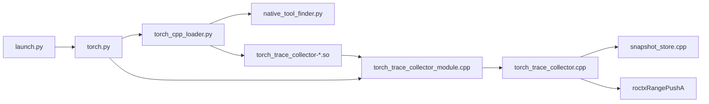
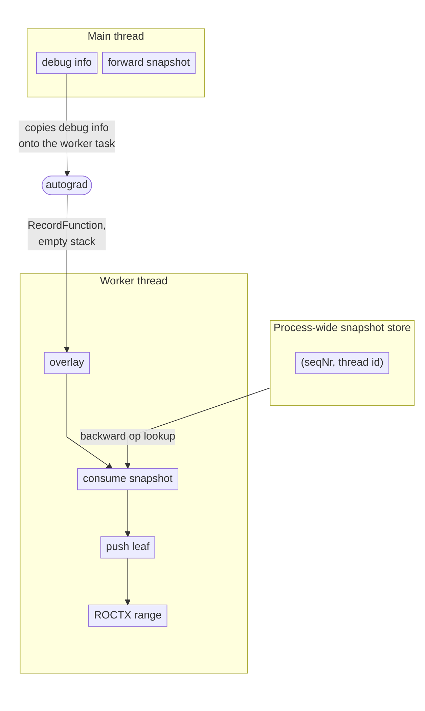

# LLD: torch_trace_collector

## Motivation

Implementation of the RecordFunction collector in `hld-torch-trace-collector.md`.

---

## Code flow

The wrap set lives in `torch.py` and does not change when the collector loads.

---

## Threading

How workers see Python scopes:

- Worker RecordFunction sees ATen and autograd names
  (`evaluate_function`, `AddmmBackward0`). It does not see Python wraps.
- The worker never runs those wraps, so debug info is how wrap frames
  reach it.
- Without that copy, worker ranges start at `evaluate_function` and omit
  `Tensor.backward`. Forward module and ATen names still appear from the
  snapshot.
- Python wraps store the live wrap stack in PyTorch's per-thread debug
  info.
- After forward returns, module wraps have popped, so when autograd
  queues the worker this is typically just `Tensor.backward`.
- Autograd copies that onto the worker. Whenever the worker stack is empty,
  those wrap frames are copied onto it.

| Step | From | Stack |
| --- | --- | --- |
| debug info | wrap stack on the main thread | **Tensor.backward** |
| forward snapshot | saved on the main thread during forward | **SimpleNet.forward / Linear.forward / aten::linear / aten::addmm** |
| overlay | debug info copied onto the worker | **Tensor.backward** |
| consume snapshot | process-wide store, prefix dedup | **Tensor.backward / SimpleNet.forward / Linear.forward / aten::linear / aten::addmm** |
| push leaf | RecordFunction name | **… / AddmmBackward0** |
| ROCTX range | full worker stack | **Tensor.backward / SimpleNet.forward / Linear.forward / aten::linear / aten::addmm / AddmmBackward0** |

- Debug info shares the wrap stack still live on the main thread. In this
  example that is `Tensor.backward`.
- It does not include `SimpleNet.forward` or `aten::addmm`; those frames
  have already left the stack.
- Consume appends that frozen forward nest, then the leaf is pushed.
  Save is not this path; it already ran on the forward thread.
- The ROCTX range is wrap + forward nest + leaf.

- Stack and debug-info guards are `thread_local` (`torch_trace_collector.cpp`).
- Snapshot store and install handle are process-wide.
- Python thread's `push_user_scope` publishes the **live** wrap stack into `ThreadLocalDebugInfo`.
- Autograd copies the main thread's `ThreadLocalState` onto the worker thread before `evaluate_function`.
- Overlay copies that restored `ThreadLocalDebugInfo` chain onto the worker's empty marker stack.

---

## RecordFunction start and end
####  `torch_trace_collector.cpp`

1. If the stack is empty, overlay debug info. If overlay pushed frames, the leaf is nested.
2. If the scope is `BACKWARD_FUNCTION`, `seqNr >= 0`, and `forwardThreadId() != 0`, consume `(seqNr, forwardThreadId)` and push frames that are not already a shared prefix. `forwardThreadId() == 0` means no forward identity (`evaluate_function` and other non-Node backward records).
3. Push the leaf (RecordFunction name plus default leaf context).
4. If the scope is `FUNCTION` and `seqNr >= 0`, save the stack (including the leaf) under `(seqNr, currentThreadId())`.
5. Format the stack, append `|torch`, `roctxRangePushA`.

Overlay and consumed snapshot frames are extra pushes. `end_cb` pops the
ROCTX range, the leaf, then those extras.

---

## Snapshot store
#### `snapshot_store.cpp`, `torch_trace_collector.cpp`

- **Insert:** After a forward leaf with a valid `seqNr` is pushed, the collector copies that thread's stack into this map. The matching backward often runs later on a worker, after those frames have popped.
- **Consume:** The matching backward looks up `(seqNr, forward thread id(non-zero))` and pushes frames the stack does not already have. This map is not debug info.
- **Overlay:** If this thread's stack is empty, copy the live wrap chain from debug info onto it (typically `Tensor.backward`). Autograd copied that TLS; it is not this map.
- **Entry:** Wrap frames plus nested ATen names, including the forward leaf.
- **Key:** `(seqNr, thread id)`. Save uses `currentThreadId()`; consume uses `forwardThreadId()`. Consume moves the entry out. A second save of the same key overwrites.
- **Shards:** 64 shards. Hash of the key picks the shard. Each has its own map, LRU, and lock. Keys in the same shard share that lock.
- **LRU:** Each shard keeps at most 10000 entries. A new key past that drops the oldest in that shard (`snapshots_dropped`).
- **Lifetime:** `pending()` is the sum of shard sizes. `uninstall()` / `clear()` empties every shard. Detached forwards stay until LRU evicts them.
- **Counters:** `dump_stats()`: `snapshots_saved`, `snapshots_consumed`, `snapshots_dropped`, `snapshots_overwritten`, and `pending()` as `snapshots_pending`.

---

## Wire format
#### `wire_format.h`

- Each ROCTX range name is the full stack: `marker1/.../markerN:context1/.../contextN[|backend]`.
- Marker `%` and `/` are `%25` and `%2F`. Contexts are not encoded.
- RecordFunction ranges append `|torch`. User-scope ranges append `|<backend>` when `backend` is non-empty.
- Profile post-processing moves `|backend` into a `Backend` column. Unrecognized suffixes are `unknown`.

- **Leaf context** (`leaf_context.h`). RecordFunction runs in C++ and does not carry a location; unlike wrap frames that have it. Dummy locations are set by `leaf_context.h` based on RecordFunction scope, `seqNr`, and whether the stack was empty after overlay — e.g. a backward op vs a nested ATen op.

---

## Build and load

- `src/lib/torch_trace_collector/CMakeLists.txt` skips the build when PyTorch is missing or unsupported. CMake looks for the PyTorch install in the `torch` directory beside `$ROCM_PATH` (sibling of the ROCm prefix).
- The version comes from `TORCH_VERSION_MAJOR` and `TORCH_VERSION_MINOR` in the PyTorch headers, not `find_package(Torch)`, and must be 2.13 or 2.14. The MODULE takes the Python include dirs and links no Python library. `PREFIX` is empty.
- CMake names the artifact `torch_trace_collector-<major>.<minor>.<Python3_SOABI>.so`. Library output is `${CMAKE_BINARY_DIR}/lib`. Install destination is `${CMAKE_INSTALL_LIBDIR}/rocprofiler-compute` (`lib` or `lib64`).
- `torch_cpp_loader.py` keys on the workload PyTorch major and minor version, from `Version(torch.__version__).release[:2]`. The ABI tag in the filename records the interpreter the artifact was built for; the loader reports it but does not require a match.

Search is rooted at the executing Python package (checkout: `src/`; install: `<prefix>/libexec/rocprofiler-compute/`). Order, via `find_prebuilt_artifacts` in `native_tool_finder.py`:

1. `<package_root>/../../lib*/rocprofiler-compute/torch_trace_collector-*.so`
2. `<package_root>/../build/lib`
3. `<package_root>/lib/_build/lib`

First unique resolved path per version wins. Install is scanned first, so a packaged `.so` beats a source build **in the same process**. Run the in-tree `rocprof-compute` (package root `src/`) to use a source build; the install glob then does not see `/opt/rocm`.

---

## Tests

  - `src/lib/torch_trace_collector/tests/test_torch_trace_collector.cpp`: verifies snapshot join of backward to forward, overlay of wrap frames on a worker, dummy locations, marker encoding, and install.
  - `tests/unit/utils/inject_roctx/_backends/test_torch_cpp_loader.py`: verifies the loader finds a matching collector artifact.
  - `tests/integration/test_profile_torch_trace.py`: verifies end-to-end `--torch-trace` on a sample workload.
  - `tests/integration/test_torch_trace_coverage.py`: compares `--torch-trace` operator and kernel coverage to `torch.profiler`.
